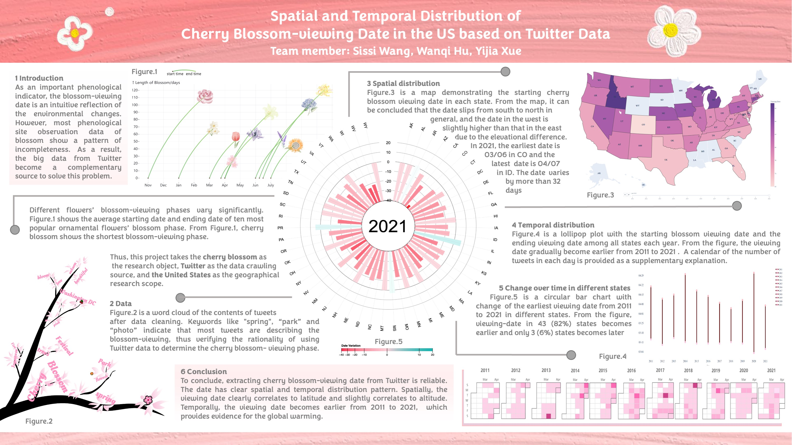

 

# **Spatial and temporal distribution of cherry blossom-viewing date in the US based on Twitter data**

## **Introduction**

Different flowers’ blossom-viewing phases vary significantly. To more accurately show the influence of climate change on the viewing dates, this project tends to focus on one specific kind of blossom with a short blossom-viewing phase. 

Phenology has become the "diagnostic fingerprint" of global climate change (Cleland et al. 2007). As an essential phenological indicator, the blossom-viewing date is a sensitive and intuitive reflection of the environmental changes. However, most blossom phenological site observation data show a pattern of incompleteness, which can hardly support the overall spatial and temporal analysis (Liu et al., 2019). As a result, the big data from Twitter, a widely used social media platform, has become a complementary source to solve this problem. 

## Data Preparing

The main data source for this project is Twitter. Tweets are scrawled using snscrape (Blair et al. 2021), a scraper for social networking services based on Python. With the keyword “cherry blossom,” 44915 pieces of tweets are found from 2011 to 2021 with the location in the US. The information for each tweet includes the time (ordinal), location (categorical), and content (categorical).

The data of different flowers’ blossom-viewing phases (ordinal) from Wikipedia (Wikipedia 2004) and data of elevation distribution (numerical) in the US from Google earth (Lisle 2006) are used as complementary data in this project.

## Data Processing

### ***Data cleaning*** 

After scrawling, the dataset was **first cleaned** by deleting the data without information of state in location and further **filtered to get rid of the keywords** like “Starbucks,” “shampoo,” and “cake,” with which tweets are not describing the true blossom. The final version was manually checked.

### ***Analysis of spatial and temporal distribution***

Spatial distribution is described in two parts: **latitude** and **altitude**. Linear regression was done respectively with each state’s average viewing date among 11 years. Temporal distribution is based on year. The viewing date is compared over the years to find whether it was significantly advanced or backward.

## Visualization Poster

# Conclusion

To conclude, extracting cherry blossom-viewing date from Twitter is effective and reliable. The cherry blossom viewing date in the US **has a clear spatial and temporal distribution pattern**. Spatially speaking, t**he viewing date correlates to latitude and slightly correlates to altitude**. Temporally speaking, the viewing date becomes earlier from 2011 to 2021, which provides evidence for global warming. 